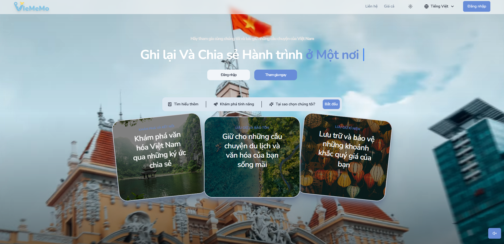
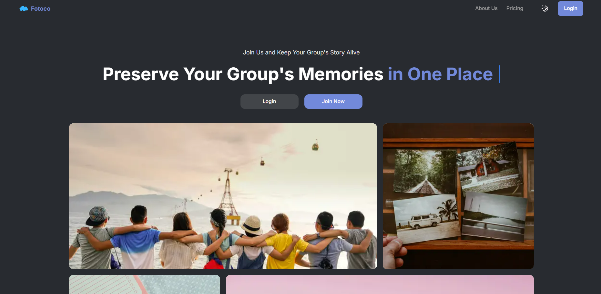
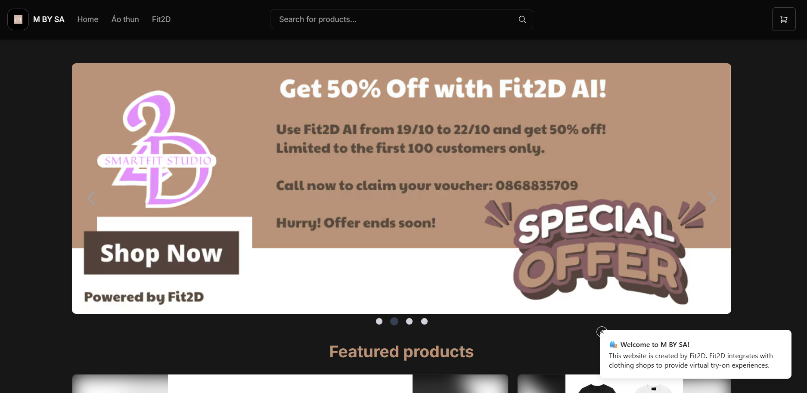
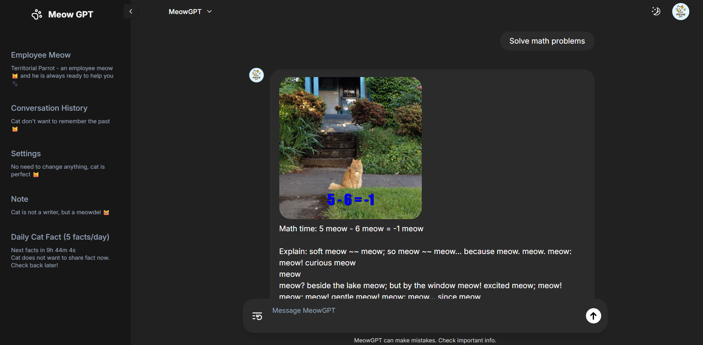
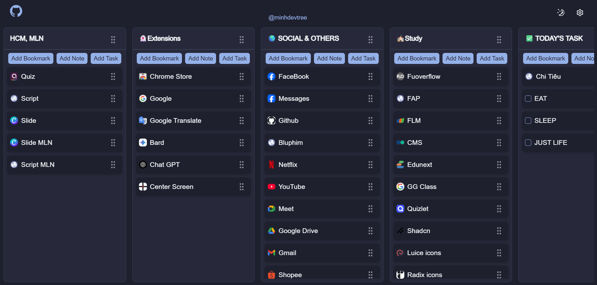

  

  

  
  
  
  <!--  -->

<h1>
  Hi there, I'm @minhdevtree
  
</h1>

### 📬 Contact Me

If you want to get in touch or offer me a job, feel free to contact me via email:  
**minhpt.vn.work@gmail.com**

---

  

---

###  About Me

Hello! I'm a passionate **Full Stack Developer**  from Hai Duong, Viet Nam.

- 🚀 I love building impactful digital products and creative solutions.
- 💻 Skilled in both **backend** and **frontend** development.
- 🧩 Strong problem-solver and enthusiastic collaborator.
- 🌱 Always learning new technologies and best practices.
- 🤝 Eager to contribute to meaningful projects and make a difference.

Let's connect and create something amazing together!

---

### :hammer_and_wrench: Languages and Tools :

  &nbsp;
  &nbsp;
  &nbsp;
  &nbsp;
  &nbsp;
  &nbsp;
  &nbsp;
  &nbsp;
  &nbsp;
  &nbsp;
  &nbsp;
  &nbsp;
  &nbsp;
  &nbsp;
  &nbsp;
  &nbsp;
  &nbsp;
  &nbsp;
  &nbsp;
  &nbsp;
  &nbsp;
  &nbsp;
  &nbsp;
  &nbsp;
  &nbsp;
  
  
  
  
  
  

---

## 🔥 My Stats

---

## 🏆 Top Languages

---

### :computer: Projects

  

<h3 align="left">
  <a href="https://viememo.io.vn" target="_blank">🌏 Viememo – Cultural Travel & Social Platform</a>
</h3>

> A platform designed to promote tourism and cultural discovery through personalized itineraries, location-based stories, and social interaction features.

**Role:**  
Project Leader · Frontend Lead · Business Analyst · Tester

**Tech Stack:**

- **Frontend:**  
  Next.js · TypeScript · Zustand · Tailwind CSS · Shadcn UI  
  Mapbox GL JS · Socket.io · TensorFlow.js
- **Backend:**  
  Node.js · Express.js · Prisma · Passport.js · Sentry · Jest
- **Infrastructure:**  
  PostgreSQL · Redis · MinIO · RabbitMQ · Docker · PM2 · Ubuntu
- **External Services:**  
  Google OAuth2 · Goong Map API · PayOS

---

  

<h3 align="left">
  <a href="https://github.com/WDP301" target="_blank">📸 Fotoco – A High-Quality Photo Sharing and Organizing Platform</a>
</h3>

> A platform alow users to create groups, where eah group can have albums for uploading photos. Members within the group can interact with the photos in the albums

**Role:**  
Project Leader · Frontend Lead · Business Analyst · Backend Developer · Tester

**Tech Stack:**

- **Frontend:**  
  Next.js · TypeScript · Zustand · Tailwind CSS · Shadcn UI · Socket.io
- **Backend:**  
  Node.js · Express.js · Prisma · Passport.js · Jest
- **Infrastructure:**  
  PostgreSQL · Redis · AWS S3 · Docker · PM2 · Vercel
- **External Services:**  
  Google OAuth2

---

  

<h3 align="left">
  <a href="https://fit2d.vercel.app/" target="_blank">👕 Fit2D – Personalized 2D Mannequin & Virtual Try-On Platform</a>
</h3>

> Fit2D is a startup project developed during my university years, designed to help users generate personalized 2D mannequins based on their own body measurements and experience realistic and precise virtual try-ons. The platform aims to bring accessibility and customization to online fashion experiences, with support for integration into third-party e-commerce websites.

As part of the project, I also collaborated with MBYSA, a fashion store, to build their own dedicated website and seamlessly integrate Fit2D's virtual try-on technology into their shopping experience—allowing customers to visualize clothing on mannequins that reflect their real body dimensions.

Fit2D was honored as one of the top 4 most promising startup projects at FPT university seminar and was selected to be presented to other students as a showcase of innovation, practicality, and entrepreneurial spirit.

**Role:**  
Founder · Fullstack Developer · Collaborator with MBYSA Store

**Tech Highlights:**

- Custom 2D mannequin generator based on user input
- Realistic garment fitting and visualization
- Web integration support for fashion stores
- Collaboration with real-world business (MBYSA)
- Recognition at academic entrepreneurship seminar

**Link:**

- [Fit2D](https://fit2d.vercel.app/)
- [MBYSA](https://mbysa.vercel.app/)
- [School Post About Fit2D](https://www.facebook.com/FPTUCareer/posts/pfbid0T2JbxWAXi21JDGVGapKz7qVaPv81hd3zgdQ9VcDNtLvZ2Bx1i8Yqo2P4y63e5Zntl?rdid=9Rgoa5PF7gqJOhPr#)
- [Docs](https://drive.google.com/drive/folders/1U19GAlRnjmbFPj4qY_B6gutnHpVLfd3l)

---

<h3 align="left">
  <a href="https://github.com/ninggiangboy/car-rental" target="_blank">🚘 Car Rental</a>
</h3>

> A platform that enables users to search for, view, and rent cars easily. Users can verify their identity to become car owners, allowing them to list their vehicles, set availability schedules, and manage rental details. The system supports secure booking, real-time availability updates, and transparent communication between renters and owners. Additional features include user reviews, payment integration, and a dashboard for tracking bookings and earnings. The platform aims to streamline the car rental process, making it convenient, safe, and accessible for both renters and vehicle owners.

**Role:**  
Frontend Developer · Backend Developer · Tester

**Tech Stack:**

- **Frontend:**  
  Next.js · TypeScript · Tailwind CSS · Shadcn UI
- **Backend:**  
  Spring Boot · PostgreSQL · Flyway · Redis · AWS S3

---

<h3 align="left">
  <a href="#" target="_blank">🍿 Movie Ticket Booking Website</a>
</h3>

> Led a project team in developing a movie tickets online, bringing convenience to movie enthusiasts and help admin manage movies, showing times, users, orders

- Design the database for the project.
- Create appropriate components for the project.
- Use socket.io to handle real-time seats selection.
- Technologies used: ReactJs, HTML, CSS and JavaScript, API, Github.

---

**_*😊 For fun only, not for production use!:*_**

  

<h3 align="left">
  <a href="https://meowgpt.minhdevtree.tech/" target="_blank">📸 MeowGPT – Ask Me Anything… as a Cat!</a>
</h3>

> MeowGPT is a light-hearted AI chatbot that answers your questions—but with a twist: it always responds as if it were a cat 🐾. Whether you're asking about technology, philosophy, or why your code won't compile, MeowGPT gives you answers full of feline wisdom and sass.

You can ask literally anything, and the cat will respond in its own meow-nificent way. This project was created just for fun and creativity

**Role:**  
Solo Developer, Idea Creator

**Tech Stack:**

- React.js, Tailwind CSS
- OpenAI GPT API??? Nooo we don't need that, we just need a cat
- Vercel for deployment

---

  

<h3 align="left">
  <a href="https://github.com/minhdevtree/bookmark" target="_blank">📸 Bookmark Manager – A Customizable Chrome New Tab Extension</a>
</h3>

> Bookmark Manager is a Chrome extension that replaces the default new tab page with a beautifully organized, highly customizable dashboard. It is divided into multiple columns, each representing a different type of content:

🔖 Bookmarks – Quick access to your favorite websites

✅ Tasks – A simple to-do list to manage your day

📝 Notes – Rich text editor powered by Tiptap for jotting down thoughts

Users can choose whether bookmarks open in the current tab or a new one, and all data is stored locally in the browser—no user tracking or data collection involved. The extension also supports data export/import, allowing easy backup and restore.

This project reflects a blend of productivity and privacy-first design, with a modern tech stack and a clean, minimal UI.

**Role:**  
Solo Developer, Idea Creator

**Tech Stack:** Next.js, TypeScript, Tailwind CSS, Tiptap, Chrome Extension APIs, LocalStorage

---
